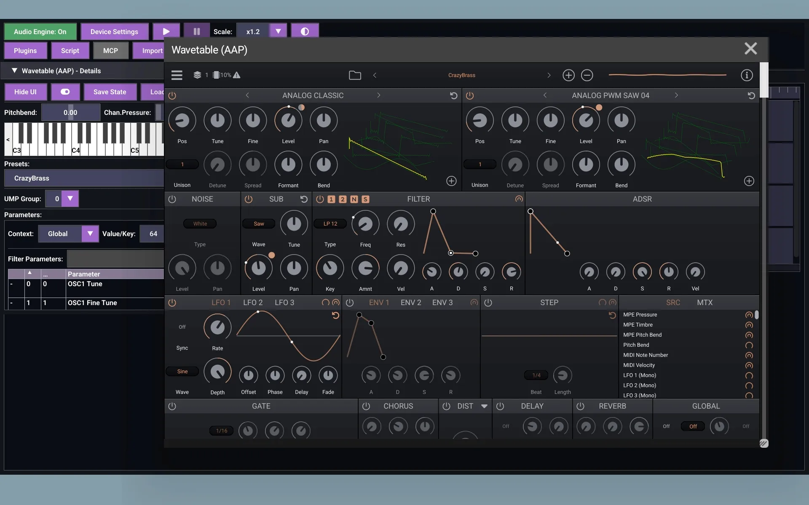

# aap-juce-wavetable

It is a port of [FigBug/Wavetable](https://github.com/FigBug/Wavetable) to [AAP (Audio Plugins For Android)](https://github.com/atsushieno/aap-core) using [aap-juce](https://github.com/atsushieno/aap-juce).

It builds on patched versions of [Gin](https://github.com/FigBug/Gin/) and other submodules the upstream uses. The changes are taken care at `aap-juce-support.patch`.

## License

Wavetable is licensed under the BSD license, and when built with JUCE the entire codebase is under the AGPLv3 license. Wavetables have their own licenses.

aap-juce-wavetable is released under the AGPLv3 license.
